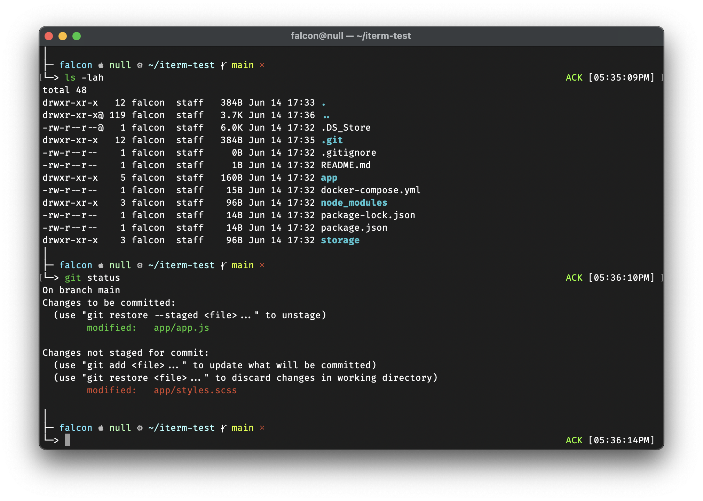

# mint zsh Theme
Mint is good, mint chocolate is great, mint-flavored zsh is awesome!
## Screenshot

## Installation
- Download the repo
- Copy `xtl-mint.zsh-theme` to `~/.oh-my-zsh/themes`
- Configure zsh theme in `~/.zshrc` (`ZSH_THEME="mint"`)
- Done
